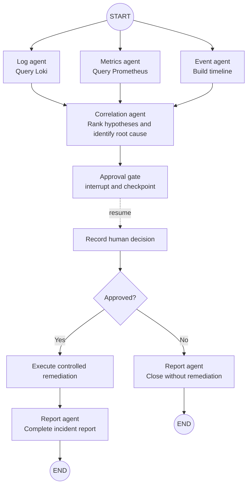
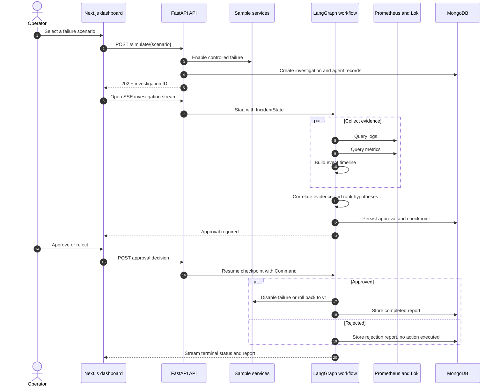
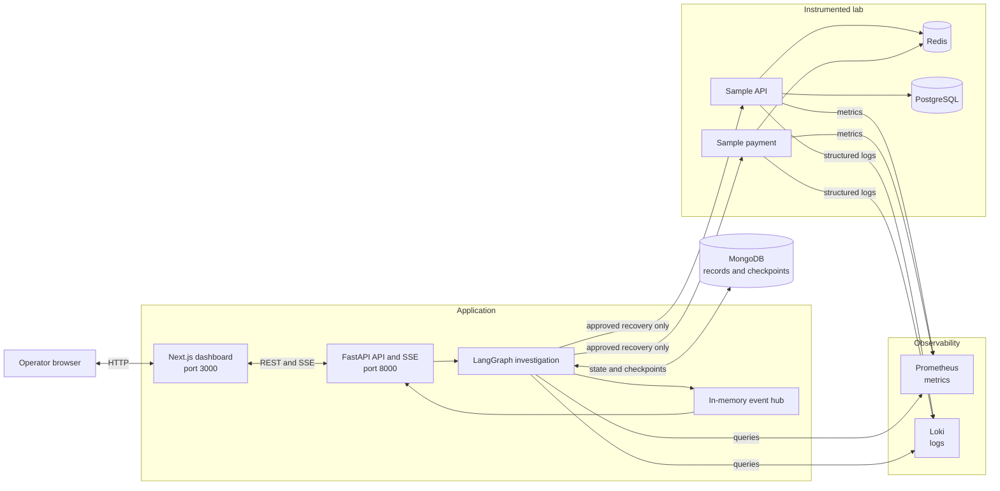

<div align="center">

# SREs

### An evidence-first incident response agent built with LangGraph

SREs turns a controlled service failure into a traceable investigation: specialist agents inspect logs, metrics, and events in parallel; a correlation agent proposes a root cause; a human approves or rejects remediation; and a report agent preserves the full decision trail.

[Quick start](#quick-start) · [Agent workflow](#agent-workflow) · [Architecture](#system-architecture) · [API](#api-walkthrough) · [Tests](#testing)

</div>

> [!NOTE]
> SREs is a local SRE laboratory. It only changes failure flags inside the bundled sample services. It does not mount the Docker socket or operate arbitrary host infrastructure.

## What SREs demonstrates

- **Parallel evidence collection** — Log, Metrics, and Event agents fan out from a shared `IncidentState` and join before correlation.
- **Grounded analysis** — findings retain their timestamp, source, message, and raw Loki or Prometheus response.
- **Human-in-the-loop safety** — LangGraph's `interrupt()` pauses every remediation and resumes the same investigation from its checkpoint after a decision.
- **Durable execution** — graph checkpoints, investigations, approvals, agent state, and reports are persisted in MongoDB.
- **Live operations UX** — FastAPI emits Server-Sent Events (SSE) to a Next.js dashboard as agent steps and state changes happen.
- **Reproducible by default** — deterministic correlation makes the complete demo work without an LLM key; OpenAI or Gemini can optionally refine the root-cause statement.
- **Real observability signals** — two instrumented FastAPI services continuously publish Prometheus metrics and structured Loki logs.

## Agent workflow

SREs uses five user-visible specialist agents. LangGraph also contains control nodes for the approval gate, decision recording, and remediation execution.



The three collector nodes use a `RetryPolicy` with up to three attempts for transient node exceptions; tool-level failures are returned as structured evidence. Their list fields use LangGraph reducers, so parallel findings and agent steps accumulate instead of overwriting one another.

### Investigation lifecycle



### Shared graph state

Every node receives the same typed `IncidentState` and returns only the fields it updates.

| State group | Representative fields | Produced by |
| --- | --- | --- |
| Identity | `incident_id`, `scenario`, `status` | API / workflow |
| Evidence | `log_findings`, `metrics_findings`, `event_findings` | Collector agents |
| Analysis | `correlation_summary`, `root_cause`, `affected_services` | Correlation agent |
| Safety | `pending_approval`, `approval_result`, `execution_result` | Approval and remediation nodes |
| Output | `report_json`, `report_markdown` | Report agent |
| Activity | `agent_steps` | All specialist agents |

## Controlled scenarios

| Scenario | Injected failure | Evidence collected | Proposed remediation |
| --- | --- | --- | --- |
| `redis-failure` | Redis access is disabled in both sample services | Connection errors, HTTP 500 rate, dependency timeline | Restore Redis-backed behavior and verify both services |
| `slow-db` | API database calls are delayed by about eight seconds | Slow-query logs and PostgreSQL/API p95 latency | Disable slow-query mode and verify latency returns to baseline |
| `bad-deployment` | Both sample services switch from `v1` to broken `v2` behavior | Deployment logs, HTTP 500 ratio, event ordering | Roll the sample services back to `v1` |

All three remediations are simulations. Approval changes only the in-process state of `sample-api` and `sample-payment`.

## System architecture



### Technology stack

| Layer | Technologies |
| --- | --- |
| Agent runtime | Python 3.11, LangGraph, LangChain tools |
| API and streaming | FastAPI, Uvicorn, SSE |
| Dashboard | Next.js 16, React 19, TypeScript, SWR |
| Persistence | MongoDB plus `MongoDBSaver` checkpoints |
| Observability | Prometheus metrics, Loki structured logs |
| Sample dependencies | Redis 7, PostgreSQL 16 |
| Local runtime | Docker Compose |

## Quick start

### Prerequisites

- Docker Engine with Docker Compose v2
- At least 4 GB of memory available to Docker
- `make`, Python 3, and Node.js only if you want to run the test suites on the host

### 1. Configure the environment

```bash
cp .env.example .env
```

The defaults run the full project in deterministic mode. No API key is required.

### 2. Start the lab

```bash
docker compose up --build
```

Compose builds the application containers, waits for their dependencies to become healthy, and starts all nine services. The sample services need a few seconds to generate enough telemetry for an investigation.

### 3. Open SREs

| Service | URL |
| --- | --- |
| Operations dashboard | <http://localhost:3000> |
| Interactive API docs | <http://localhost:8000/docs> |
| Prometheus | <http://localhost:9090> |
| Loki API | <http://localhost:3100> |

In the dashboard, choose **Simulate**, start one of the three scenarios, watch the agent activity stream, and review the approval request. Approving resumes the graph and performs the controlled recovery; rejecting produces a final report without executing remediation.

### 4. Stop the lab

```bash
docker compose down
```

Named volumes preserve MongoDB records and telemetry between runs. To intentionally remove them too, use `docker compose down -v`.

## Configuration

Edit `.env` before starting Compose.

| Variable | Default | Purpose |
| --- | --- | --- |
| `LLM_PROVIDER` | `deterministic` | `deterministic`, `openai`, or `gemini` |
| `OPENAI_API_KEY` | empty | Enables OpenAI-assisted root-cause phrasing |
| `GEMINI_API_KEY` | empty | Enables Gemini-assisted root-cause phrasing |
| `LANGSMITH_TRACING` | `false` | Enables LangSmith tracing when set to `true` |
| `LANGSMITH_API_KEY` | empty | Authenticates LangSmith tracing |
| `LANGSMITH_PROJECT` | `sres-incident-response` | LangSmith project name |
| `SIMULATION_WARMUP_SECONDS` | `10` | Telemetry warm-up before graph execution |
| `FRONTEND_HOST_PORT` | `3000` | Dashboard host port |
| `BACKEND_HOST_PORT` | `8000` | API host port |

The remaining host bindings are documented in [`.env.example`](.env.example). Container-to-container addresses remain unchanged when a host port is customized.

### Optional LLM providers

Deterministic mode remains the source of the scenario evidence and recovery logic. When `openai` or `gemini` is configured with a key, the provider is used only to refine the concise root-cause statement; failures automatically fall back to the deterministic result.

For example:

```dotenv
LLM_PROVIDER=openai
OPENAI_API_KEY=your-key
```

For observability in LangSmith:

```dotenv
LANGSMITH_TRACING=true
LANGSMITH_API_KEY=your-key
LANGSMITH_PROJECT=sres-incident-response
```

## API walkthrough

The dashboard is the intended operator experience, but the complete lifecycle is also available over HTTP.

Start an investigation:

```bash
curl -sS -X POST http://localhost:8000/simulate/bad-deployment \
  -H 'Content-Type: application/json' \
  -d '{"auto_start_investigation": true}'
```

The response includes an `investigation_id` and `stream_url`. Copy the ID, then inspect state or follow SSE events:

```bash
export INVESTIGATION_ID="paste-investigation-id"
curl -sS "http://localhost:8000/investigation/$INVESTIGATION_ID"
curl -N "http://localhost:8000/stream/investigation/$INVESTIGATION_ID"
```

When the status becomes `awaiting_approval`, copy the pending `approval_id` and decide:

```bash
export APPROVAL_ID="paste-approval-id"
curl -sS -X POST \
  "http://localhost:8000/investigation/$INVESTIGATION_ID/approval/$APPROVAL_ID" \
  -H 'Content-Type: application/json' \
  -d '{"decision": "approve"}'
```

Use `{"decision":"reject"}` to close the investigation without executing the action.

## Project structure

```text
.
├── backend/
│   ├── app/
│   │   ├── workflow.py      # LangGraph nodes, edges, interrupt, and resume
│   │   ├── tools.py         # Prometheus, Loki, correlation, and report tools
│   │   ├── main.py          # FastAPI routes, SSE, stores, and checkpointer wiring
│   │   ├── models.py        # IncidentState and API models
│   │   ├── store.py         # MongoDB and in-memory persistence adapters
│   │   └── llm.py           # Deterministic/OpenAI/Gemini provider switch
│   └── tests/
├── frontend/                # Next.js operations dashboard
├── sample-apps/             # Instrumented API and payment services
├── prometheus/              # Scrape configuration
├── loki/                    # Local Loki configuration
├── postgres/                # Sample database initialization
├── docker-compose.yml       # Complete nine-service environment
└── Makefile                 # Install, test, smoke, and lifecycle commands
```

The graph itself lives in [`backend/app/workflow.py`](backend/app/workflow.py), and its shared state schema lives in [`backend/app/models.py`](backend/app/models.py).

## Testing

Install host-side test dependencies once:

```bash
make install
```

Then run:

```bash
make test           # backend pytest suite + frontend typecheck and Vitest
make smoke          # validate Compose + exercise the approval workflow
```

You can also run each suite independently with `make test-backend` or `make test-frontend`.

## Design notes

- **State is evidence, not prompt text.** Nodes store raw findings and build any model input at the point of use.
- **Collectors converge before analysis.** LangGraph's multi-start fan-out and join ensure the correlation agent sees all three evidence streams.
- **The interrupt node is side-effect free.** Approval writes happen after resume, preventing replay from duplicating a decision.
- **Safety is explicit in the graph.** A rejected decision has a terminal report path that never touches the remediation node.
- **The UI follows the same narrative.** Investigation, evidence, approval, and report remain separate stages connected by one durable record.

## Further reading

- [LangGraph overview](https://docs.langchain.com/oss/python/langgraph/overview)
- [LangGraph persistence](https://docs.langchain.com/oss/python/langgraph/persistence)
- [LangGraph interrupts](https://docs.langchain.com/oss/python/langgraph/interrupts)
- [FastAPI documentation](https://fastapi.tiangolo.com/)

---

Built as a safe, observable environment for learning and demonstrating stateful agent orchestration in incident response.
