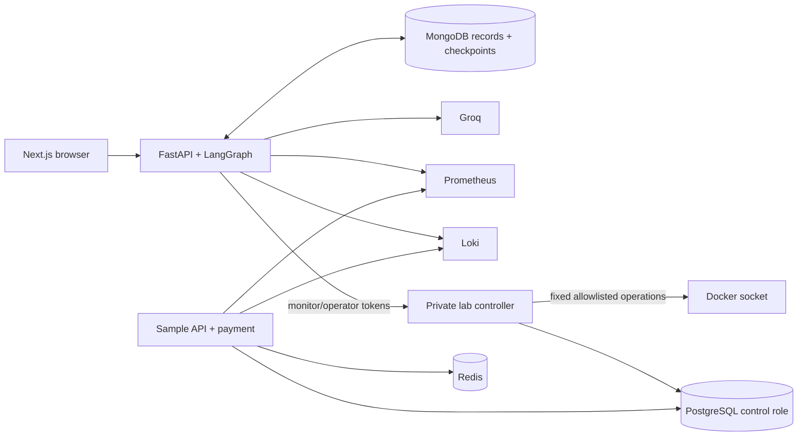

<div align="center">

# SREs

### Evidence-first incident response with LangGraph and human approval

SREs is a local incident lab where Groq-backed agents investigate real failures in bundled services, propose a bounded operational action, pause for human approval, and verify recovery from fresh application and telemetry observations.

[Quick start](#quick-start) · [Scenarios](#real-lab-scenarios) · [Architecture](#architecture) · [API](#api-walkthrough) · [Tests](#testing)

</div>

> [!IMPORTANT]
> This is a controlled local lab, not a production SRE platform. Its incidents are deliberately selected, but the underlying failures are real Docker, PostgreSQL, and release changes. The lab controller mounts the Docker socket and must run only on a disposable, dedicated environment.

## What is real

- The sample API and payment service continuously make real HTTP, Redis, and PostgreSQL calls.
- Prometheus scrapes measured request counters and latency histograms. Loki stores application logs with original timestamps.
- A Redis run stops the actual allowlisted Redis container.
- A database run holds a real PostgreSQL relation lock from an identifiable backend session.
- A release run replaces the sample API container with a separately built v2 image containing a real `KeyError` regression.
- Every visible Log, Metrics, Event, Correlation, and Report result requires a Groq response. Missing credentials, invalid structured output, or unavailable evidence fail closed; runtime code has no canned diagnosis or fallback report.
- Approved actions execute through a private controller and are checked against the exact observed container, image, database PID, and backend start time.
- Recovery requires three consecutive successful application rounds, the action-specific infrastructure postcondition, and fresh acceptable Prometheus telemetry.

The business records and workload are fixtures. Payment probes are explicitly lab records; no external payment provider is contacted.

## Agent workflow

```mermaid
flowchart TD
    START((START)) --> LOG[Log agent]
    START --> METRICS[Metrics agent]
    START --> EVENT[Event agent]
    LOG --> CORRELATE[Correlation agent]
    METRICS --> CORRELATE
    EVENT --> CORRELATE
    CORRELATE -->|supported action| APPROVAL[Human approval interrupt]
    CORRELATE -->|no supported action| REPORT[Report agent]
    APPROVAL -->|approved| EXECUTE[Controller operation]
    APPROVAL -->|rejected| REJECTED[Rejection report]
    EXECUTE --> VERIFY[Functional, resource, telemetry checks]
    VERIFY --> REPORT
    REPORT --> END((END))
    REJECTED --> END
```



Log, Metrics, and Event collectors gather scenario-independent evidence. The selected lab scenario and private injection record are not included in their model prompts. Correlation must cite valid finding IDs and infrastructure observation IDs; the cited observation payload must contain every frozen action identity.

The LangGraph interrupt is side-effect free. Approval is reserved atomically, the graph resumes from its MongoDB checkpoint, and the execution node sends only the already approved parameters.

## Real lab scenarios

| Scenario | Injected failure | Observable symptom | Allowed recovery |
| --- | --- | --- | --- |
| `redis-unavailable` | Stop the allowlisted Compose Redis container | Real dependency exceptions and 5xx responses in both sample services | Start that same observed container ID |
| `database-blocking` | Hold `ACCESS EXCLUSIVE` on `users` from a dedicated PostgreSQL session | The actual application `SELECT` waits and times out | Terminate the observed lab blocker after PID/start-time revalidation |
| `release-regression` | Replace sample API v1 with a prepared v2 image | `/api/products` raises a real `KeyError` and returns 503 | Replace the observed v2 container with the prepared, previously observed v1 image |

A run has a maximum 15-minute lifetime. Rejection performs no remediation; explicit cleanup or the controller watchdog restores the bounded lab state and records that recovery separately from agent action.

## Architecture



### Trust boundaries

- Only `lab-controller` receives `/var/run/docker.sock`; the browser, backend agents, and model do not.
- Monitoring and operator credentials are separate server-only values. Neither is exposed through `NEXT_PUBLIC_*`, API records, or model audits.
- Docker resources must match the configured Compose project and service allowlist.
- The controller accepts a fixed action union. It does not accept shell commands, SQL strings, arbitrary images, mount paths, or arbitrary Docker options.
- PostgreSQL uses separate application, observation, and lab-controller roles. Session termination is limited to the controlled lab blocker.
- Operation IDs are approval IDs, making controller requests idempotent. Every operation stores requested/running/final state and before/after observations.
- Container replacement keeps the previous container staged until the replacement is created, connected, and started; a failed swap restores the previous container.

The Docker socket is still host-privileged. Authentication and allowlists reduce application risk but are not a security boundary against a compromised controller process.

## Quick start

### Prerequisites

- Docker Engine with Docker Compose v2
- Python 3.11+, Node.js, and `make` for host-side tests
- A Groq API key

### Configure and start

```bash
cp .env.example .env
# Set GROQ_API_KEY and replace both LAB_*_TOKEN values with different random values.
make prepare-releases
docker compose up --build -d
```

`make prepare-releases` builds immutable local `sres-sample-api:v1` and `:v2` images before the release scenario is available. `postgres-bootstrap` idempotently provisions the restricted database roles even when an existing data volume is reused.

Open:

| Service | URL |
| --- | --- |
| Dashboard | <http://localhost:3001> |
| API docs | <http://localhost:8000/docs> |
| Prometheus | <http://localhost:9090> |
| Loki | <http://localhost:3100> |

Use **Incident lab** to start a bounded fault, or start a manual investigation without injecting anything. Review the observed identities and provenance references before approving an operation.

Stop the stack with `docker compose down`. Named volumes preserve records. Use `docker compose down -v` only when you intentionally want to delete local data.

## Configuration

Important values are documented in [`.env.example`](.env.example):

| Variable | Purpose |
| --- | --- |
| `GROQ_API_KEY`, `GROQ_MODEL` | Required model connection used by every specialist |
| `GROQ_MAX_TOKENS` | Default bounded output limit; correlation uses a slightly larger explicit schema budget |
| `LAB_MONITOR_TOKEN` | Read-only controller observations |
| `LAB_OPERATOR_TOKEN` | Fault injection, cleanup, and approved operations |
| `INVESTIGATION_WARMUP_SECONDS` | Neutral telemetry warm-up before collection |
| `VERIFICATION_*` | Consecutive rounds, interval, and maximum recovery window |
| `COMPOSE_PROJECT_NAME` | Project identity used by controller resource resolution |

The backend and controller use host networking for local provider and published-service access. The controller listens only on `127.0.0.1:8010`; it is intentionally absent from the public Compose port list.

## API walkthrough

Start a real controlled release incident:

```bash
curl -sS -X POST http://localhost:8000/lab/runs \
  -H 'Content-Type: application/json' \
  -d '{"scenario":"release-regression","auto_start_investigation":true,"ttl_seconds":900}'
```

Start an investigation without injecting a fault:

```bash
curl -sS -X POST http://localhost:8000/investigations \
  -H 'Content-Type: application/json' \
  -d '{"services":["api-server"],"symptom":"Product requests are returning errors."}'
```

Inspect or stream it:

```bash
export INVESTIGATION_ID="paste-investigation-id"
curl -sS "http://localhost:8000/investigation/$INVESTIGATION_ID"
curl -N "http://localhost:8000/stream/investigation/$INVESTIGATION_ID"
```

Approve only after reviewing the frozen parameters and cited observations:

```bash
export APPROVAL_ID="paste-approval-id"
curl -sS -X POST \
  "http://localhost:8000/investigation/$INVESTIGATION_ID/approval/$APPROVAL_ID" \
  -H 'Content-Type: application/json' \
  -d '{"decision":"approve"}'
```

Operator audit and cleanup are separate:

```bash
export LAB_RUN_ID="paste-lab-run-id"
curl -sS "http://localhost:8000/lab/runs/$LAB_RUN_ID"
curl -sS -X POST "http://localhost:8000/lab/runs/$LAB_RUN_ID/cleanup"
```

## Records and outcomes

New investigations use `evidence_version=3`. Version 2 records remain readable as historical lab-control data, but their approvals cannot execute controller operations.

These concepts are deliberately separate:

- **Model assessment**: `incident_detected`, `no_incident_observed`, or `insufficient_evidence`.
- **Operation result**: whether the exact approved mutation succeeded, failed, or was stale.
- **Recovery verification**: whether application probes, infrastructure postconditions, and fresh telemetry prove recovery.
- **Recovery origin**: agent action, operator cleanup, automatic cleanup, external action, or unverified.

A successful controller acknowledgement never becomes a recovery claim by itself, and model-written report prose cannot override failed verification.

## Project structure

```text
backend/app/          API, LangGraph workflow, tools, controller client, verification
backend/tests/        contract, workflow, controller, sample-app, and verification tests
lab-controller/app/   private authenticated Docker/PostgreSQL operations and journals
frontend/             Next.js operator workspace
sample-apps/          instrumented services plus distinct v1/v2 product handlers
postgres/             fixture schema and idempotent restricted-role bootstrap
scripts/              prepared release-image build and acceptance helpers
docker-compose.yml    local lab topology
```

## Testing

```bash
make install
make test              # backend plus frontend tests
make test-controller   # controller boundary tests
make smoke             # Compose validation plus focused workflow contract
make prepare-releases  # build both fixed release images
RUN_REAL_LAB=1 REAL_LAB_API_URL=http://localhost:8000 make test-real-groq
```

Unit tests use explicit model doubles only inside test modules. Runtime modules never import those doubles. Real-Groq acceptance is opt-in and must target a running disposable lab; it does not silently replace provider calls with fixtures.

## Honest limits

- This iteration provides one shared active-run lease, not multi-tenant isolation.
- The backend event hub is in memory; durable records and checkpoints survive restart, but already emitted SSE events are process-local.
- The controller is designed for the bundled Compose project, not arbitrary production infrastructure.
- A likely root cause remains model analysis supported by evidence, not mathematical proof or a certified incident conclusion.
- Local Docker image IDs are used because repository digests may not exist for local builds.

SREs is built to demonstrate inspectable agent orchestration: real observations, explicit uncertainty, frozen human-approved operations, and measured recovery.
